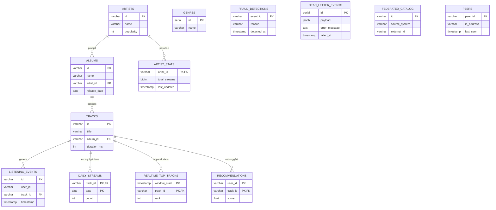

1. Pourquoi listening_events est indexé sur timestamp ET date_trunc('hour', timestamp) ?

On utilise deux index car ils servent à deux besoins différents.

L'index sur timestamp permet de retrouver rapidement les écoutes sur une période précise.
Exemple : toutes les écoutes entre 14h00 et 15h00.
L'index sur date_trunc('hour', timestamp) permet de regrouper rapidement les écoutes par heure.

Sans cet index, PostgreSQL devrait recalculer l'heure pour chaque ligne, ce qui serait beaucoup plus lent lorsqu'il y a des millions d'écoutes.

2. Quelle est la différence entre daily_streams et realtime_top_tracks ?

La différence principale est la vitesse de mise à jour.

daily_streams
Les données sont calculées une fois par jour.
On obtient le nombre total d'écoutes de chaque morceau dans la journée.
C'est un traitement batch.
tandis que 
realtime_top_tracks
Les données sont mises à jour presque en temps réel.
On peut voir immédiatement quels morceaux sont les plus populaires.
C'est un traitement streaming avec Spark.

3. Pourquoi dead_letter_events.payload est JSONB plutôt que TEXT ?

JSONB est utilisé à la place de TEXT parce qu'il est beaucoup plus facile d'exploiter les données qu'il contient.

Avec TEXT, PostgreSQL voit uniquement une chaîne de caractères.
Avec JSONB, PostgreSQL comprend la structure du JSON et peut accéder directement aux champs.

